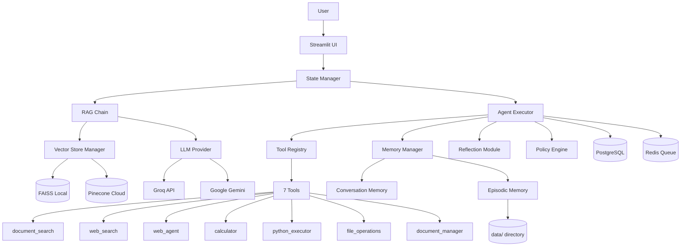
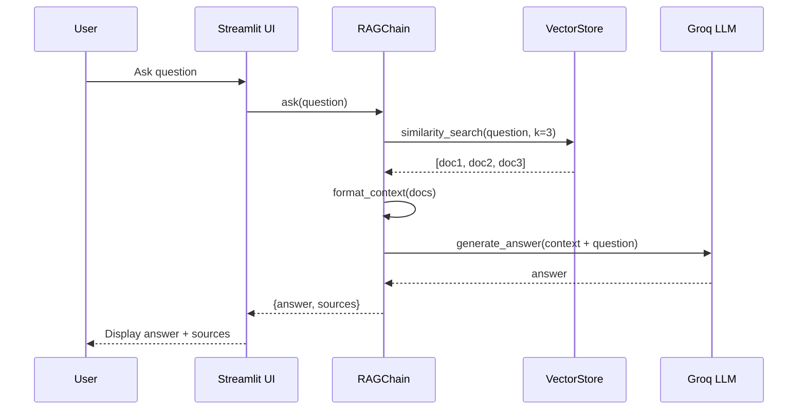
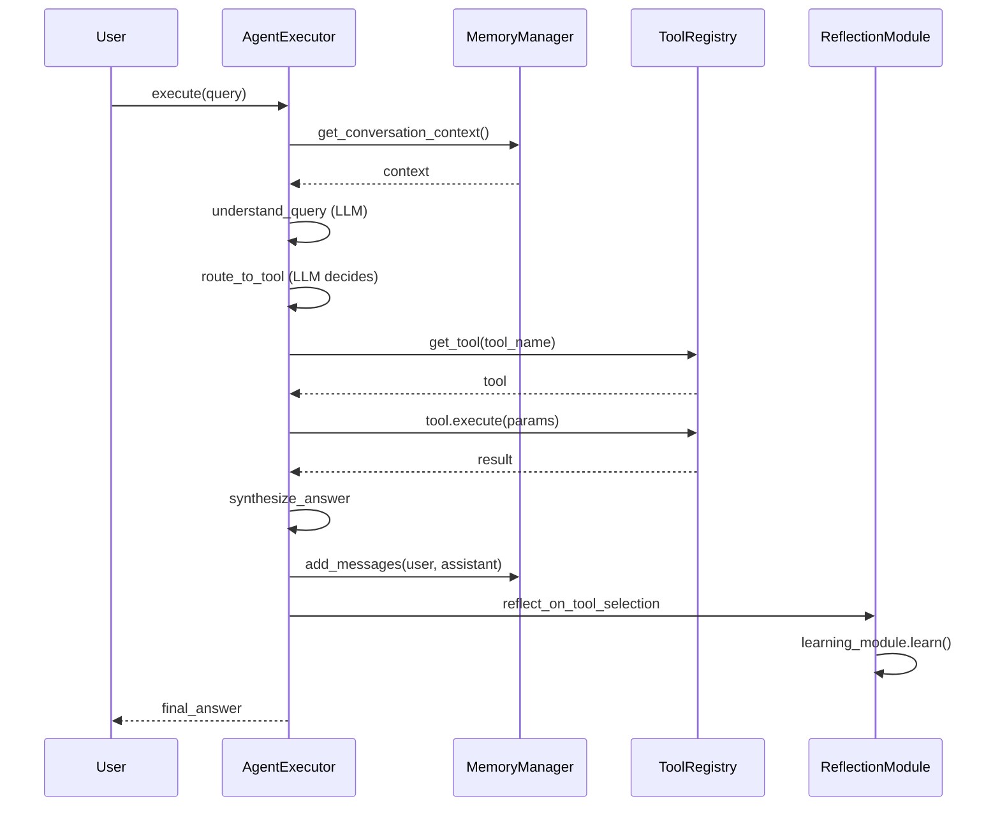

# RAG Agent Codebase Guide

**Last Updated:** 2026-02-03
**Status:** Production-ready with Phase 4 features

---

## Table of Contents

1. [Executive Summary](#executive-summary)
2. [Talk Track](#talk-track)
3. [Quickstart](#quickstart)
4. [Architecture](#architecture)
5. [Repository Map](#repository-map)
6. [Key Flows](#key-flows)
7. [Configuration](#configuration)
8. [API & Interfaces](#api--interfaces)
9. [Data Model](#data-model)
10. [Tools & Capabilities](#tools--capabilities)
11. [Security & Privacy](#security--privacy)
12. [Deployment](#deployment)
13. [Troubleshooting](#troubleshooting)

---

## Executive Summary

### What It Does
A production-ready Retrieval-Augmented Generation (RAG) system with autonomous agent capabilities. Users ask questions, the system retrieves relevant documents, and generates accurate answers grounded in your data.

**Key Features:**
- **RAG Pipeline**: Document upload → embedding → vector search → LLM answer generation
- **Agent System**: 7 specialized tools with intelligent routing (web search, code execution, file ops, etc.)
- **Memory System**: Short-term conversation memory + long-term episodic memory
- **Self-Reflection**: Agent evaluates its decisions and learns from mistakes
- **Web Browsing**: Autonomous web agent that extracts clean content from URLs
- **Production Features**: Policy engine, Redis queue, OpenTelemetry observability, PostgreSQL persistence

**Evidence:** [README.md](README.md#L3-L8), [src/rag_chain.py](src/rag_chain.py#L15-L16)

### Who Uses It
- **End Users**: Via Streamlit web UI (chat interface)
- **Developers**: Via Python API (`RAGChain.ask()` or `AgentExecutorV3.execute()`)
- **Background Workers**: Via Redis task queue for async processing

### Problem Solved
Traditional Q&A systems hallucinate or provide outdated information. This system:
1. Grounds answers in your documents (no hallucinations)
2. Provides source attribution (know where answers come from)
3. Handles complex multi-step queries via agent tools
4. Remembers context across conversations
5. Learns and improves over time

---

## Talk Track

### 60-Second Pitch
"This is a RAG chatbot powered by Groq's fast LLM and local embeddings. Upload documents, ask questions, get accurate answers with sources. Plus an agent layer with 7 tools—web search, code execution, file ops—that intelligently routes queries and remembers conversations. Production-ready with policies, observability, and queue workers."

### 5-Minute Explanation

**1. Core RAG (2 min)**
- User uploads PDFs/docs → chunked into 800-char pieces
- Each chunk embedded using HuggingFace sentence-transformers
- Stored in FAISS (local) or Pinecone (cloud) vector database
- Query → retrieve top-K similar chunks → LLM generates answer
- Evidence: [src/document_loader.py](src/document_loader.py), [src/vector_store.py](src/vector_store.py)

**2. Agent Layer (2 min)**
- Built with LangGraph state machines
- 7 tools: document_search, web_search, web_agent, calculator, python_executor, file_operations, document_manager
- LLM decides which tool(s) to use based on query
- Example: "latest AI news" → web_search finds URLs → web_agent extracts content → synthesizes answer
- Evidence: [src/agent/agent_executor_v3.py](src/agent/agent_executor_v3.py#L22-L32)

**3. Production Features (1 min)**
- Memory: Conversation buffer + episodic summaries persisted to disk/PostgreSQL
- Reflection: Agent evaluates tool selection, learns success patterns
- Policy Engine: YAML-based rules for rate limiting, cost control, content filtering
- Observability: OpenTelemetry tracing to Jaeger/Honeycomb
- Evidence: [src/policy/default_policies.yaml](src/policy/default_policies.yaml), [src/observability.py](src/observability.py)

### Common Questions

**Q: How fast is it?**
A: Groq API provides 10-100x faster inference than OpenAI. Local embeddings after first download. FAISS searches millions of vectors in milliseconds.
Evidence: [README.md](README.md#L517-L520)

**Q: What about hallucinations?**
A: Prompt explicitly instructs LLM to answer ONLY from retrieved context. Source attribution lets users verify. Reflection module can detect low-quality answers.
Evidence: [src/rag_chain.py](src/rag_chain.py#L33-L40)

**Q: How does the agent decide which tool to use?**
A: LLM receives tool descriptions in prompt, uses chain-of-thought reasoning to select. Learning module tracks tool success rates to improve future routing.
Evidence: [src/agent/agent_executor_v3.py](src/agent/agent_executor_v3.py#L103-L141), [src/agent/reflection/learning_module.py](src/agent/reflection/learning_module.py#L192-L212)

**Q: Can it browse the web?**
A: Yes. web_agent tool uses Playwright to fetch pages, readability-lxml to extract clean content, avoiding ads/navigation.
Evidence: [src/agent/tools/web_agent_tool.py](src/agent/tools/web_agent_tool.py)

**Q: Is it production-ready?**
A: Yes. Policy engine enforces limits, observability tracks performance, PostgreSQL persists sessions, Redis enables distributed processing, checkpointing prevents data loss.
Evidence: [DEPLOYMENT_GUIDE.md](DEPLOYMENT_GUIDE.md), [POLICY_ENGINE_GUIDE.md](POLICY_ENGINE_GUIDE.md)

---

## Quickstart

### Prerequisites
- Python 3.11+ (tested on 3.14)
- 4GB RAM minimum
- Groq API key (free from https://console.groq.com)

### Setup (5 minutes)

```bash
# 1. Clone and install
git clone https://github.com/ar-aishwaryanand-glitch/rag-chatbot.git
cd rag-chatbot
pip install -r requirements.txt

# 2. Install Playwright for web agent
playwright install chromium

# 3. Configure environment
cp .env.example .env
# Edit .env and add your GROQ_API_KEY
```

**Minimal .env:**
```bash
GROQ_API_KEY=your_key_here
LLM_PROVIDER=groq
GROQ_MODEL=llama-3.3-70b-versatile
EMBEDDING_PROVIDER=huggingface
EMBEDDING_MODEL=sentence-transformers/all-MiniLM-L6-v2
```

Evidence: [README.md](README.md#L158-L198)

### Run Locally

```bash
# Agent UI (recommended - full features)
streamlit run run_agent_ui.py

# Basic RAG UI (simple Q&A only)
streamlit run run_ui.py

# Open http://localhost:8501
```

Evidence: [run_agent_ui.py](run_agent_ui.py)

### Quick Test

```python
from src.system_init import initialize_system

# Initialize RAG chain
rag = initialize_system()

# Ask a question
result = rag.ask("What is retrieval-augmented generation?")
print(result['answer'])
print(result['sources'])
```

Evidence: [src/system_init.py](src/system_init.py#L11-L34)

### Common Issues

**Issue:** `ImportError: No module named 'groq'`
**Fix:** `pip install langchain-groq`

**Issue:** `Certificate verification failed` (Playwright)
**Fix:** `export NODE_TLS_REJECT_UNAUTHORIZED=0 && playwright install chromium`

**Issue:** `Vector store not initialized`
**Fix:** Upload documents first or switch to sample documents mode
Evidence: [PERSISTENCE_BUGS_ANALYSIS.md](PERSISTENCE_BUGS_ANALYSIS.md#L10-L53)

---

## Architecture

### High-Level Components



Evidence: Component relationships inferred from [src/system_init.py](src/system_init.py), [src/agent/agent_executor_v3.py](src/agent/agent_executor_v3.py#L34-L101)

### Data Flow: RAG Query



Evidence: [src/rag_chain.py](src/rag_chain.py#L197-L289)

### Data Flow: Agent Query



Evidence: [src/agent/agent_executor_v3.py](src/agent/agent_executor_v3.py#L103-L141)

---

## Repository Map

### Directory Structure

| Path | Purpose | Key Files |
|------|---------|-----------|
| `src/` | Core application code | All Python modules |
| `src/agent/` | Agent system (Phase 3+4) | `agent_executor_v3.py`, `tool_registry.py` |
| `src/agent/tools/` | Tool implementations | 7 tool files (see below) |
| `src/agent/memory/` | Memory system | `memory_manager.py`, `episodic_memory.py` |
| `src/agent/reflection/` | Self-reflection & learning | `reflection_module.py`, `learning_module.py` |
| `src/database/` | PostgreSQL persistence | `models.py`, `session_manager.py`, `checkpoint_backend.py` |
| `src/policy/` | Policy engine | `policy_engine.py`, `default_policies.yaml` |
| `src/queue/` | Redis message queue | `task_queue.py`, `worker.py`, `scheduler.py` |
| `src/ui/` | Streamlit UI | `streamlit_app_agent.py`, `state_manager.py` |
| `data/` | Runtime data storage | `documents/`, `vector_store/`, `episodic_memory/` |
| `data/documents/` | Sample documents | 6 markdown files on AI/RAG topics |
| `data/uploaded/` | User-uploaded documents | Created at runtime |

Evidence: Directory tree from `find` command output

### Most Important Files

**Entry Points:**
- [run_agent_ui.py](run_agent_ui.py) - Streamlit agent UI launcher (recommended)
- [src/ui/streamlit_app_agent.py](src/ui/streamlit_app_agent.py) - Agent UI implementation
- [queue_worker.py](queue_worker.py) - Redis background worker

**Core Pipeline:**
- [src/rag_chain.py](src/rag_chain.py) - RAG query pipeline (retrieve + generate)
- [src/document_manager.py](src/document_manager.py) - Unified vector store interface
- [src/vector_store.py](src/vector_store.py) - FAISS vector store manager
- [src/embeddings.py](src/embeddings.py) - Embedding generation

**Agent System:**
- [src/agent/agent_executor_v3.py](src/agent/agent_executor_v3.py) - Agent orchestration with LangGraph
- [src/agent/tool_registry.py](src/agent/tool_registry.py) - Tool management
- [src/agent/memory/memory_manager.py](src/agent/memory/memory_manager.py) - Memory coordination

**Configuration:**
- [src/config.py](src/config.py) - Central configuration from environment variables
- [.env](.env) - Environment variables (**NEVER COMMIT WITH REAL KEYS**)

---

## Key Flows

### Flow 1: Document Upload & Indexing

**Trigger:** User uploads PDF/DOCX in Streamlit UI

**Steps:**
1. `src/ui/document_handler.py` → `handle_file_upload()` saves file to `data/uploaded/`
2. `src/document_loader.py` → `load_documents()` parses file (PyPDF for PDF, python-docx for DOCX)
3. `RecursiveCharacterTextSplitter` chunks text (800 chars, 100 overlap)
4. `src/embeddings.py` → `EmbeddingManager.embed_documents()` generates embeddings via HuggingFace
5. `src/vector_store.py` → `VectorStoreManager.create_vector_store()` adds to FAISS with rate limiting (batch_size=3, delay=2s)
6. FAISS index saved to `data/vector_store/`

**Data Transformations:**
```
PDF bytes → PyPDF → text string → chunks (List[Document])
→ embeddings (List[List[float]]) → FAISS index
```

**Failure Modes:**
- File parsing error → returns error message, doesn't crash
- Embedding API rate limit → batch processing with delays
- FAISS index corruption → auto-loads from disk on restart (fixed in commit af1b006)

**Evidence:** [src/document_loader.py](src/document_loader.py), [src/vector_store.py](src/vector_store.py#L27-L38), [PERSISTENCE_BUGS_ANALYSIS.md](PERSISTENCE_BUGS_ANALYSIS.md#L26-L51)

### Flow 2: RAG Query

**Trigger:** User submits question in UI

**Steps:**
1. `streamlit_app_agent.py` → user input → `agent.execute(query)`
2. `RAGChain.ask(question)` in [src/rag_chain.py](src/rag_chain.py#L197-L289)
3. `retrieve_context()` → FAISS similarity search (top_k=3 by default)
4. `format_context()` → joins chunks with source metadata
5. `generate_answer()` → LLM call with prompt template
6. Returns `{answer, context, sources}`

**LLM Prompt:**
```
System: You are a helpful AI assistant that answers questions based on provided context.
Instructions:
- Use ONLY the information from the context below
- If context doesn't contain info, say "I don't have enough information"
- Mention which source you used
Context: [Retrieved chunks]
Human: [User question]
```

**Performance:**
- Vector search: ~10-50ms for 1000 documents
- LLM generation: 500-2000ms (Groq is 10-100x faster than OpenAI)
- Total: typically < 3 seconds

**Evidence:** [src/rag_chain.py](src/rag_chain.py#L88-L289)

### Flow 3: Agent Tool Execution

**Trigger:** Complex query like "what's the latest AI news?"

**Steps:**
1. `AgentExecutorV3.execute()` in [src/agent/agent_executor_v3.py](src/agent/agent_executor_v3.py)
2. LangGraph state machine: `understand → route → execute → synthesize → reflect`
3. **Understand phase:** LLM analyzes query with memory context
4. **Route phase:** LLM selects tool(s) based on descriptions
   - Tool descriptions passed in prompt: "web_search: Search the internet for current information..."
5. **Execute phase:** Tool runs (e.g., `web_search.execute()` → DuckDuckGo API)
6. **Synthesize phase:** LLM generates final answer from tool results
7. **Reflect phase:** `ReflectionModule` evaluates tool selection, `LearningModule` records success/failure

**Auto-Chaining Example:**
Query: "latest AI news" → web_search (gets URLs) → agent sees URLs in result → automatically calls web_agent (extracts content) → synthesizes answer

**Evidence:** [src/agent/agent_executor_v3.py](src/agent/agent_executor_v3.py#L143-L295)

### Flow 4: Memory Persistence

**Trigger:** Session ends or periodic saves

**Steps:**
1. Conversation messages stored in `MemoryManager.conversation_memory` (in-memory buffer)
2. On finalize: `memory_manager.finalize_session()` creates Episode
3. Episode serialized to JSON and saved to `data/episodic_memory/<session_id>.json`
4. Learning data serialized to pickle: `data/learning/learning_data.pkl`
5. Reflection history appended to JSONL: `data/reflections/reflections.jsonl`

**Reload on Restart:**
- `EpisodicMemory.__init__()` → `_load_episodes()` reads all JSON files
- `LearningModule.__init__()` → `_load_data()` unpickles learning data
- `ReflectionModule.__init__()` → `_load_reflections()` reads JSONL line-by-line

**Evidence:** [src/agent/memory/episodic_memory.py](src/agent/memory/episodic_memory.py#L79-L132), [PERSISTENCE_BUGS_ANALYSIS.md](PERSISTENCE_BUGS_ANALYSIS.md#L59-L152)

### Flow 5: Policy Enforcement

**Trigger:** Any agent action (tool call, LLM request)

**Steps:**
1. `PolicyEngine.evaluate()` in [src/policy/policy_engine.py](src/policy/policy_engine.py)
2. Loads policies from [src/policy/default_policies.yaml](src/policy/default_policies.yaml)
3. Evaluates in priority order (200 → 150 → 100 → 50)
4. Checks: tool whitelist/blacklist, rate limits, content filters, cost limits
5. Actions: ALLOW, DENY, WARN, THROTTLE, REQUIRE_APPROVAL
6. Violations logged to PostgreSQL `policy_violations` table (if enabled)

**Example Policy:**
```yaml
tool_policies:
  - rule_id: block_dangerous_tools
    action: deny
    priority: 200
    blocked_tools:
      - system_command
      - execute_shell
```

**Evidence:** [POLICY_ENGINE_GUIDE.md](POLICY_ENGINE_GUIDE.md), [src/policy/default_policies.yaml](src/policy/default_policies.yaml)

---

## Configuration

### All Config Sources

1. **Environment variables** (`.env` file) - see [src/config.py](src/config.py)
2. **Policy YAML** - [src/policy/default_policies.yaml](src/policy/default_policies.yaml)
3. **Runtime overrides** - Streamlit sidebar widgets

### Core Settings

| Key | Meaning | Default | Where Used |
|-----|---------|---------|------------|
| `GROQ_API_KEY` | Groq API authentication | *required* | [src/rag_chain.py:69](src/rag_chain.py#L69) |
| `LLM_PROVIDER` | LLM backend (groq/google) | `groq` | [src/config.py:19](src/config.py#L19) |
| `GROQ_MODEL` | Model name | `llama-3.3-70b-versatile` | [src/config.py:22](src/config.py#L22) |
| `EMBEDDING_PROVIDER` | Embedding backend | `huggingface` | [src/config.py:28](src/config.py#L28) |
| `EMBEDDING_MODEL` | HF model | `sentence-transformers/all-MiniLM-L6-v2` | [src/config.py:29-32](src/config.py#L29-L32) |
| `CHUNK_SIZE` | Text chunk size | `800` | [src/config.py:35](src/config.py#L35) |
| `CHUNK_OVERLAP` | Chunk overlap | `100` | [src/config.py:36](src/config.py#L36) |
| `TOP_K_RESULTS` | Retrieved chunks | `3` | [src/config.py:39](src/config.py#L39) |
| `USE_PINECONE` | Use Pinecone vs FAISS | `false` | [src/config.py:45](src/config.py#L45) |
| `DATABASE_URL` | PostgreSQL connection | `None` | [src/config.py:101](src/config.py#L101) |
| `REDIS_URL` | Redis connection | `redis://localhost:6379/0` | [src/config.py:113](src/config.py#L113) |
| `ENABLE_OBSERVABILITY` | OpenTelemetry tracing | `false` | [src/config.py:122](src/config.py#L122) |

### Environment-Specific

**Development:**
```bash
AGENT_VERBOSE=true
REFLECTION_ENABLED=true
CODE_EXECUTOR_ENABLED=false  # Safety
USE_POLICY_ENGINE=false  # Lenient during dev
```

**Production:**
```bash
AGENT_VERBOSE=false
USE_POLICY_ENGINE=true
USE_POSTGRES=true
USE_CHECKPOINTS=true
ENABLE_OBSERVABILITY=true
OTEL_EXPORTER_TYPE=otlp
OTEL_EXPORTER_ENDPOINT=http://jaeger:4317
```

Evidence: [src/config.py](src/config.py#L11-L144)

---

## API & Interfaces

### HTTP Endpoints (Streamlit)

The system doesn't expose REST APIs directly. Streamlit runs on port 8501 by default.

**Access:**
```bash
streamlit run run_agent_ui.py --server.port 8501
# Opens browser to http://localhost:8501
```

**UI Endpoints (pages):**
- `/` - Main chat interface
- No multi-page support currently (single-page app)

### Python API

**Basic RAG:**
```python
from src.system_init import initialize_system

# Initialize
rag_chain = initialize_system(use_documents=True)

# Query
result = rag_chain.ask(
    question="What is RAG?",
    top_k=3  # Optional, defaults to Config.TOP_K_RESULTS
)

# Result structure:
# {
#   "question": str,
#   "answer": str,
#   "context": List[Document],
#   "sources": List[Dict[str, str]]
# }
```

**Agent API:**
```python
from src.agent.agent_executor_v3 import AgentExecutorV3
from src.agent.tool_registry import ToolRegistry
from src.config import Config

# Setup
tool_registry = ToolRegistry()
# ... register tools ...

agent = AgentExecutorV3(
    llm=llm,
    tool_registry=tool_registry,
    config=Config,
    enable_memory=True,
    enable_reflection=True
)

# Execute
result = agent.execute(
    query="What's the latest AI news?",
    session_id="user123",
    user_id="user@example.com"
)

# Result structure:
# {
#   "answer": str,
#   "reasoning": str,
#   "tools_used": List[str],
#   "sources": List[Dict],
#   "memory_context": str
# }
```

Evidence: [src/rag_chain.py](src/rag_chain.py#L197-L289), [src/agent/agent_executor_v3.py](src/agent/agent_executor_v3.py)

### Redis Queue API

**Submit Task:**
```python
from src.queue import TaskQueue, TaskPriority

queue = TaskQueue()

task_id = queue.submit_task(
    query="Analyze this data",
    priority=TaskPriority.HIGH,
    user_id="user123",
    metadata={"source": "api"}
)

# Get result
result = queue.get_result(task_id, timeout=60)
```

**Worker:**
```bash
python queue_worker.py
```

Evidence: [REDIS_QUEUE_GUIDE.md](REDIS_QUEUE_GUIDE.md), [src/queue/task_queue.py](src/queue/task_queue.py)

---

## Data Model

### Vector Store (FAISS/Pinecone)

**Document Schema:**
```python
Document(
    page_content: str,  # Chunk text
    metadata: {
        "source": str,      # e.g., "rag-overview.md"
        "topic": str,       # e.g., "RAG Systems"
        "chunk_id": int,    # 0, 1, 2, ...
        "total_chunks": int
    }
)
```

Evidence: [src/document_loader.py](src/document_loader.py)

### PostgreSQL Tables

**Sessions:**
```sql
CREATE TABLE sessions (
    session_id TEXT PRIMARY KEY,
    user_id TEXT,
    title TEXT,
    created_at TIMESTAMP,
    updated_at TIMESTAMP,
    metadata JSONB,
    is_active BOOLEAN
);
```

**Messages:**
```sql
CREATE TABLE messages (
    message_id SERIAL PRIMARY KEY,
    session_id TEXT REFERENCES sessions(session_id),
    role TEXT,  -- 'user', 'assistant', 'system'
    content TEXT,
    timestamp TIMESTAMP,
    metadata JSONB,
    tool_calls JSONB,
    sources JSONB
);
```

**Checkpoints (LangGraph):**
```sql
CREATE TABLE checkpoints (
    thread_id TEXT,
    checkpoint_id TEXT,
    parent_checkpoint_id TEXT,
    checkpoint JSONB,
    metadata JSONB,
    PRIMARY KEY (thread_id, checkpoint_id)
);
```

Evidence: [src/database/models.py](src/database/models.py), [src/database/postgres_backend.py](src/database/postgres_backend.py)

### File System Storage

**Episodic Memory:**
```
data/episodic_memory/
  <session_id>.json
```

**JSON Structure:**
```json
{
  "session_id": "abc123",
  "timestamp": "2026-02-03T10:30:00",
  "summary": "User asked about RAG. Tools used: document_search",
  "user_queries": ["What is RAG?"],
  "tools_used": ["document_search"],
  "outcomes": ["success"],
  "key_entities": ["RAG", "retrieval"]
}
```

**Learning Data:**
```
data/learning/
  learning_data.pkl  # Pickled Python objects
```

**Reflections:**
```
data/reflections/
  reflections.jsonl  # One JSON object per line
```

Evidence: [src/agent/memory/episodic_memory.py](src/agent/memory/episodic_memory.py#L79-L132), [PERSISTENCE_BUGS_ANALYSIS.md](PERSISTENCE_BUGS_ANALYSIS.md)

---

## Tools & Capabilities

### Available Tools

| Tool Name | Purpose | Key Function | Evidence |
|-----------|---------|--------------|----------|
| `document_search` | Search uploaded docs (RAG) | `rag_chain.ask()` | [src/agent/tools/rag_tool.py](src/agent/tools/rag_tool.py) |
| `web_search` | Quick web search (returns URLs) | DuckDuckGo API | [src/agent/tools/web_search_tool.py](src/agent/tools/web_search_tool.py) |
| `web_agent` | Extract full content from URLs | Playwright + readability | [src/agent/tools/web_agent_tool.py](src/agent/tools/web_agent_tool.py) |
| `calculator` | Math calculations | `numexpr.evaluate()` | [src/agent/tools/calculator_tool.py](src/agent/tools/calculator_tool.py) |
| `python_executor` | Safe Python code execution | RestrictedPython sandbox | [src/agent/tools/code_executor_tool.py](src/agent/tools/code_executor_tool.py) |
| `file_operations` | File system ops (list/read/write) | Sandboxed to `data/workspace/` | [src/agent/tools/file_ops_tool.py](src/agent/tools/file_ops_tool.py) |
| `document_manager` | Manage uploaded docs | List/delete documents | [src/agent/tools/doc_management_tool.py](src/agent/tools/doc_management_tool.py) |

### Tool Selection Logic

LLM receives this prompt:
```
Available tools:
- document_search: Search through uploaded documents for information about [topics in your knowledge base]
- web_search: Search the internet for current information, news, and real-time data
- web_agent: Visit specific URLs and extract their full content with proper formatting
- calculator: Perform mathematical calculations
- python_executor: Execute Python code for data analysis or computation
- file_operations: List, read, or write files in the workspace
- document_manager: View and manage uploaded documents

Based on the query, which tool(s) should be used?
```

**Selection Examples:**
- "What is RAG?" → `document_search` (knowledge base query)
- "Latest AI news" → `web_search` → URLs → `web_agent` (auto-chain)
- "Calculate 15% of $2500" → `calculator`
- "Run Python to sort a list" → `python_executor`

Evidence: [src/agent/tool_registry.py](src/agent/tool_registry.py#L64-L75), [src/agent/agent_executor_v3.py](src/agent/agent_executor_v3.py#L177-L229)

---

## Security & Privacy

### Authentication
**Current State:** None (single-user mode)
**TODO:** Add user auth before production deployment

### Authorization
**Policy Engine:** Controls which tools users can access
**File Ops Sandbox:** Restricted to `data/workspace/` directory
Evidence: [src/agent/tools/file_ops_tool.py](src/agent/tools/file_ops_tool.py), [src/policy/default_policies.yaml](src/policy/default_policies.yaml#L30-L40)

### Secret Handling
**Secrets in `.env`:**
- `GROQ_API_KEY` - loaded via `python-dotenv`, never logged
- `PINECONE_API_KEY` - same
- `DATABASE_URL` - contains password, never logged

**Never log or return secrets to users.**

**Evidence:** [src/config.py](src/config.py#L8-L9) uses `load_dotenv()`, no print statements of API keys

### Input Validation

**LLM Prompts:**
- Truncated to prevent injection: `query[:100]` in spans
- No user input directly executed as code (except via `python_executor` tool which uses RestrictedPython sandbox)

**File Uploads:**
- Only PDF, DOCX, TXT, MD allowed (validated by Streamlit file_uploader `type` parameter)
- Parsed by trusted libraries (PyPDF, python-docx)

**SQL:**
- Uses parameterized queries (psycopg2/psycopg3) - no SQL injection risk
- Evidence: [src/database/postgres_backend.py](src/database/postgres_backend.py)

### Common Vulnerabilities

**✅ Protected Against:**
- SQL Injection (parameterized queries)
- Code Injection (RestrictedPython sandbox)
- Path Traversal (file ops sandboxed to workspace)
- Prompt Injection (limited by truncation, but not fully solved)

**⚠️ TODO:**
- Rate limiting per user (currently per-system via policy engine)
- User authentication
- HTTPS in production deployment
- Secrets management via Vault/AWS Secrets Manager

---

## Deployment

### Local Development
```bash
streamlit run run_agent_ui.py
```

### Docker (TODO)
No Dockerfile currently. Recommended approach:
```dockerfile
FROM python:3.11-slim
WORKDIR /app
COPY requirements.txt .
RUN pip install -r requirements.txt && playwright install chromium
COPY . .
CMD ["streamlit", "run", "run_agent_ui.py", "--server.port", "8501", "--server.address", "0.0.0.0"]
```

### Streamlit Cloud
1. Push to GitHub
2. Connect at https://share.streamlit.io
3. Add secrets in dashboard (GROQ_API_KEY, etc.)
4. Deploy

Evidence: [README.md](README.md#L543-L560)

### Production Checklist
- [ ] Enable `USE_POLICY_ENGINE=true`
- [ ] Configure PostgreSQL: `USE_POSTGRES=true`, set `DATABASE_URL`
- [ ] Enable observability: `ENABLE_OBSERVABILITY=true`, configure OTLP endpoint
- [ ] Set up Redis for queue: `USE_REDIS_QUEUE=true`, start workers
- [ ] Disable dangerous tools: `CODE_EXECUTOR_ENABLED=false`
- [ ] Configure rate limits in [src/policy/default_policies.yaml](src/policy/default_policies.yaml)
- [ ] Set up monitoring (Jaeger/Honeycomb)
- [ ] Add user authentication (not implemented yet)
- [ ] Use HTTPS (reverse proxy like nginx)

Evidence: [DEPLOYMENT_GUIDE.md](DEPLOYMENT_GUIDE.md)

---

## Troubleshooting

### Symptom: "Vector store not initialized"

**Cause:** Vector store not loaded from disk on startup (bug fixed in commit af1b006)
**Where to Look:** [src/vector_store.py:27-38](src/vector_store.py#L27-L38)
**Fix:** Pull latest code, or manually upload documents and rebuild index
Evidence: [PERSISTENCE_BUGS_ANALYSIS.md](PERSISTENCE_BUGS_ANALYSIS.md#L10-L53)

### Symptom: Slow embedding generation

**Cause:** HuggingFace downloads model on first run (~90MB)
**Where to Look:** [src/embeddings.py](src/embeddings.py)
**Fix:** Wait for download, subsequent runs are instant (model cached)

### Symptom: LLM rate limit errors

**Cause:** Groq free tier limits
**Where to Look:** [src/rag_chain.py:69](src/rag_chain.py#L69) (Groq API call)
**Fix:** Wait and retry, or upgrade Groq plan

### Symptom: Web agent fails to extract content

**Cause:** Playwright not installed or site blocks automation
**Where to Look:** [src/agent/tools/web_agent_tool.py](src/agent/tools/web_agent_tool.py)
**Fix:**
1. `playwright install chromium`
2. Check site's robots.txt
3. Try different URL

### Symptom: PostgreSQL connection failed

**Cause:** Database not running or wrong credentials
**Where to Look:** [src/config.py:101-106](src/config.py#L101-L106), [src/database/postgres_backend.py](src/database/postgres_backend.py)
**Fix:**
1. Start PostgreSQL: `brew services start postgresql@15` (macOS)
2. Create database: `createdb rag_chatbot`
3. Run migrations: `python init_database.py`

Evidence: [POSTGRES_SETUP.md](POSTGRES_SETUP.md)

### Symptom: Memory not persisting

**Cause:** Bugs in learning/reflection modules (fixed in recent commits)
**Where to Look:** [src/agent/reflection/learning_module.py](src/agent/reflection/learning_module.py), [src/agent/reflection/reflection_module.py](src/agent/reflection/reflection_module.py)
**Fix:** Pull latest code (commits 91ec72f, a10db84)
Evidence: [PERSISTENCE_BUGS_ANALYSIS.md](PERSISTENCE_BUGS_ANALYSIS.md#L59-L183)

### Symptom: Agent selects wrong tool

**Cause:** Tool descriptions unclear or learning module needs more data
**Where to Look:** Tool descriptions in [src/agent/tools/*.py](src/agent/tools/)
**Fix:**
1. Improve tool descriptions to be more specific
2. Let agent process more queries to learn patterns
3. Check `data/learning/learning_data.pkl` for tool success rates

### Symptom: Policy violations not logging

**Cause:** PostgreSQL not configured or policy engine disabled
**Where to Look:** [src/config.py:109](src/config.py#L109), [src/policy/policy_engine.py](src/policy/policy_engine.py)
**Fix:** Set `USE_POLICY_ENGINE=true` and `USE_POSTGRES=true` in `.env`

### Symptom: High memory usage

**Cause:** FAISS index loaded entirely in RAM
**Where to Look:** [src/vector_store.py](src/vector_store.py)
**Fix:**
1. Switch to Pinecone (cloud-based): `USE_PINECONE=true`
2. Reduce document corpus size
3. Use smaller embedding model

### Symptom: Observability traces not appearing

**Cause:** Wrong exporter endpoint or observability disabled
**Where to Look:** [src/config.py:122-133](src/config.py#L122-L133), [src/observability.py](src/observability.py)
**Fix:**
1. Set `ENABLE_OBSERVABILITY=true`
2. Start Jaeger: `docker run -d -p 16686:16686 -p 4317:4317 jaegertracing/all-in-one:latest`
3. Set `OTEL_EXPORTER_ENDPOINT=http://localhost:4317`
4. Check Jaeger UI at http://localhost:16686

### Symptom: Code executor tool disabled

**Cause:** Safety setting (disabled by default)
**Where to Look:** [src/config.py:82](src/config.py#L82)
**Fix:** Set `CODE_EXECUTOR_ENABLED=true` in `.env` (only in trusted environments)

---

## Glossary

| Term | Definition | Where in Code |
|------|------------|---------------|
| **RAG** | Retrieval-Augmented Generation - retrieve docs then generate answer | [src/rag_chain.py](src/rag_chain.py) |
| **Embedding** | Vector representation of text for similarity search | [src/embeddings.py](src/embeddings.py) |
| **Vector Store** | Database for storing/searching embeddings (FAISS or Pinecone) | [src/vector_store.py](src/vector_store.py) |
| **Chunk** | Text segment (800 chars default) for indexing | [src/config.py:35](src/config.py#L35) |
| **LangGraph** | State machine framework for agents | [src/agent/agent_executor_v3.py:103](src/agent/agent_executor_v3.py#L103) |
| **Tool** | Agent capability (search, calculate, etc.) | [src/agent/tools/](src/agent/tools/) |
| **Episodic Memory** | Long-term summaries of past sessions | [src/agent/memory/episodic_memory.py](src/agent/memory/episodic_memory.py) |
| **Reflection** | Agent self-evaluation of decisions | [src/agent/reflection/reflection_module.py](src/agent/reflection/reflection_module.py) |
| **Policy** | Rule governing agent behavior (rate limits, etc.) | [src/policy/default_policies.yaml](src/policy/default_policies.yaml) |
| **Checkpoint** | Saved agent state for crash recovery | [src/database/checkpoint_backend.py](src/database/checkpoint_backend.py) |

---

## Appendix

### Key Dependencies
- `langchain-groq` - Groq LLM integration
- `langchain-huggingface` - HuggingFace embeddings
- `faiss-cpu` - Local vector search
- `pinecone-client` - Cloud vector database
- `streamlit` - Web UI framework
- `langgraph` - Agent state machines
- `playwright` - Web browsing automation
- `psycopg2` / `psycopg` - PostgreSQL adapters
- `redis` - Message queue client
- `opentelemetry-*` - Observability

Evidence: [requirements.txt](requirements.txt)

### Open Questions / TODOs

1. **User Authentication:** How to implement? OAuth? JWT? (No auth currently)
2. **Scaling:** How to handle 1000+ concurrent users? (Currently single-instance)
3. **Cost Tracking:** How to accurately track per-user costs? (Policy engine has basic support)
4. **Multi-tenancy:** How to isolate user data? (Pinecone namespaces partially solve this)
5. **Test Coverage:** What's the current test coverage? (No test files found - **CRITICAL TODO**)

**Files Needed for Full Understanding:**
- Test suite (doesn't exist yet)
- CI/CD configuration (no `.github/workflows/` found)
- Production deployment config (Dockerfile, k8s manifests)

### Related Documentation
- [README.md](README.md) - Quick start and feature overview
- [DEPLOYMENT_GUIDE.md](DEPLOYMENT_GUIDE.md) - Production deployment
- [POLICY_ENGINE_GUIDE.md](POLICY_ENGINE_GUIDE.md) - Policy configuration
- [REDIS_QUEUE_GUIDE.md](REDIS_QUEUE_GUIDE.md) - Queue setup
- [OBSERVABILITY_GUIDE.md](OBSERVABILITY_GUIDE.md) - Monitoring setup
- [PERSISTENCE_BUGS_ANALYSIS.md](PERSISTENCE_BUGS_ANALYSIS.md) - Recent bug fixes

---

**End of Codebase Guide**
*This document is accurate as of 2026-02-03. Update when major changes occur.*
